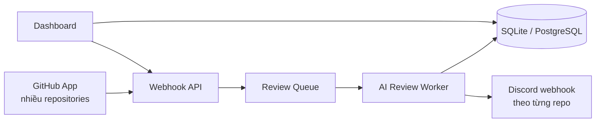

# PR Review Agent — Bản thiết kế ban đầu

## 1. Tổng quan

PR Review Agent là một dịch vụ độc lập tự động phân tích Pull Request trên GitHub và gửi
kết quả review đến Discord. Dịch vụ có dashboard để quản lý nhiều repository, cấu hình
review riêng cho từng repository và theo dõi lịch sử các lần chạy.

Mục tiêu của phiên bản đầu tiên là kiểm chứng ba yếu tố:

- Chất lượng nhận xét do mô hình AI tạo ra.
- Chi phí và thời gian review cho mỗi Pull Request.
- Trải nghiệm nhận và đọc kết quả review trên Discord.

Phiên bản đầu không tự merge, approve hoặc reject Pull Request. Agent chỉ đưa ra nhận xét để
con người quyết định.

## 2. Luồng hoạt động



Luồng xử lý một Pull Request:

1. GitHub gửi sự kiện `pull_request` khi PR được mở, mở lại hoặc có commit mới.
2. Webhook API xác minh chữ ký và kiểm tra repository đã được bật review hay chưa.
3. API ghi một review run với trạng thái `queued` rồi trả phản hồi ngay cho GitHub.
4. Worker lấy metadata và diff của PR bằng GitHub API.
5. Worker loại bỏ file không cần review và chia diff thành các phần vừa với context window.
6. Mô hình AI phân tích diff và trả về kết quả JSON có cấu trúc.
7. Hệ thống kiểm tra, loại trùng và giới hạn số lượng findings.
8. Kết quả được lưu vào database và gửi đến Discord webhook của repository.

## 3. Kiến trúc đề xuất

### GitHub integration

Sử dụng một GitHub App dùng chung cho tất cả repository. Mỗi lần cài đặt app tạo ra một
`installation_id`; backend dùng ID này cùng tên repository để tìm đúng cấu hình.

Quyền tối thiểu dự kiến:

- `Contents: read` để đọc source và diff khi cần.
- `Pull requests: read` để đọc metadata, commit và file của PR.
- `Pull requests: write` chỉ bổ sung sau này nếu agent cần đăng inline comment lên GitHub.

Các sự kiện cần đăng ký:

- `pull_request.opened`
- `pull_request.reopened`
- `pull_request.synchronize`
- Có thể bổ sung `pull_request.ready_for_review` để bỏ qua draft PR.

### Webhook API

Webhook API chịu trách nhiệm:

- Xác minh `X-Hub-Signature-256` bằng webhook secret.
- Chỉ chấp nhận event và action được hỗ trợ.
- Tạo idempotency key từ repository, PR number và `head_sha`.
- Đưa công việc vào queue và trả `202 Accepted` nhanh chóng.
- Không gọi mô hình AI trực tiếp trong HTTP request.

### Review worker

Worker thực hiện phần xử lý tốn thời gian:

- Lấy PR diff và metadata.
- Áp dụng ignore rules của repository.
- Chia diff theo file hoặc hunk.
- Gọi model và parse structured output.
- Kiểm tra line number có thực sự thuộc diff hay không.
- Gộp findings trùng nhau và sắp xếp theo severity.
- Lưu kết quả rồi gửi Discord.

### Discord notifier

Mỗi repository có thể dùng một Discord webhook khác nhau. Nội dung nên được gửi dưới dạng
embed, gồm:

- Repository, số PR, tiêu đề và tác giả.
- Link trực tiếp tới Pull Request.
- Mức rủi ro tổng thể.
- Các finding quan trọng kèm file và dòng.
- Trạng thái review và thời gian xử lý.

Luôn đặt `allowed_mentions.parse` thành danh sách rỗng để nội dung từ PR không tạo mention
ngoài ý muốn.

## 4. Dashboard MVP

Dashboard ban đầu chỉ cần ba màn hình.

### Repositories

- Danh sách repository đã kết nối.
- Trạng thái bật hoặc tắt auto review.
- Discord destination hiện tại.
- Model và policy đang sử dụng.
- Token usage của tháng UTC hiện tại.
- Trạng thái lần review gần nhất.

### Repository settings

- Bật hoặc tắt auto review.
- Discord webhook URL.
- Chọn event kích hoạt review.
- Bỏ qua draft PR hoặc review ngay.
- Model, giới hạn output mỗi call và token budget theo tháng UTC.
- Severity tối thiểu được gửi đến Discord.
- File pattern cần bỏ qua.
- Custom review instructions.
- Giới hạn số file, số dòng diff và số findings.

### Review runs

- Danh sách các lần review.
- Trạng thái `queued`, `running`, `completed`, `failed` hoặc `skipped`.
- PR number, head SHA, thời gian chạy và token usage.
- Summary và findings.
- Lỗi đã xảy ra.
- Nút chạy lại review hoặc gửi lại kết quả sang Discord.

## 5. Data model tối thiểu

### `repositories`

| Field | Ý nghĩa |
| --- | --- |
| `id` | ID nội bộ |
| `github_installation_id` | GitHub App installation |
| `owner` | Chủ repository |
| `name` | Tên repository |
| `enabled` | Có tự động review hay không |
| `created_at` | Thời điểm kết nối |

### `review_configs`

| Field | Ý nghĩa |
| --- | --- |
| `repository_id` | Repository áp dụng cấu hình |
| `discord_webhook_encrypted` | Discord webhook URL đã mã hóa |
| `model` | Model dùng để review |
| `minimum_severity` | Mức thấp nhất được gửi đi |
| `ignored_paths` | Pattern file cần bỏ qua |
| `custom_instructions` | Quy tắc review riêng |
| `max_files` | Số file tối đa |
| `max_diff_lines` | Số dòng diff tối đa |
| `max_findings` | Số finding tối đa |
| `max_output_tokens_per_call` | Trần output token của mỗi model call |
| `monthly_token_budget` | Token budget của repository theo tháng UTC |

### `review_runs`

| Field | Ý nghĩa |
| --- | --- |
| `id` | ID lần chạy |
| `repository_id` | Repository được review |
| `pull_number` | Số Pull Request |
| `head_sha` | Commit được review |
| `status` | Trạng thái xử lý |
| `summary` | Tóm tắt kết quả |
| `risk` | Mức rủi ro tổng thể |
| `input_tokens` | Token đầu vào |
| `output_tokens` | Token đầu ra |
| `model_calls` | Số model call đã thực hiện |
| `usage_period_start` | Tháng UTC chứa reservation của lần chạy |
| `usage_reservation_tokens` | Token đang giữ chỗ trước khi settle |
| `usage_settled_at` | Thời điểm reservation được settle hoặc release |
| `error` | Lỗi nếu có |
| `created_at` | Thời điểm tạo |
| `completed_at` | Thời điểm hoàn tất |

### `findings`

| Field | Ý nghĩa |
| --- | --- |
| `review_run_id` | Lần review chứa finding |
| `severity` | `critical`, `high`, `medium`, `low` |
| `file` | Đường dẫn file |
| `line` | Dòng trong diff |
| `title` | Tiêu đề ngắn |
| `explanation` | Giải thích vấn đề |
| `suggestion` | Hướng xử lý đề xuất |
| `fingerprint` | Khóa dùng để loại finding trùng |

### `repository_usage`

| Field | Ý nghĩa |
| --- | --- |
| `repository_id` | Repository được đo usage |
| `period_start` | Ngày đầu tháng UTC; duy nhất trong repository |
| `reserved_tokens` | Token đã giữ chỗ cho các run chưa kết thúc |
| `input_tokens` | Token đầu vào thực tế đã settle |
| `output_tokens` | Token đầu ra thực tế đã settle |
| `model_calls` | Tổng số model call đã settle |
| `review_runs` | Tổng số review run đã settle |

## 6. Output của mô hình

Model phải trả JSON có cấu trúc thay vì Markdown tự do:

```json
{
  "summary": "PR bổ sung xử lý đăng nhập",
  "risk": "medium",
  "findings": [
    {
      "severity": "high",
      "file": "src/auth.py",
      "line": 48,
      "title": "Token không được kiểm tra thời hạn",
      "explanation": "Token hết hạn vẫn có thể được chấp nhận",
      "suggestion": "Kiểm tra trường exp trước khi tạo session",
      "confidence": 0.92
    }
  ]
}
```

Hệ thống không được tin hoàn toàn vào output này. Backend phải validate schema, severity,
file path và line number trước khi lưu hoặc gửi đi.

## 7. Review policy mặc định

Agent ưu tiên phát hiện:

- Lỗi logic hoặc edge case có thể tái hiện.
- Security vulnerability và nguy cơ lộ dữ liệu.
- Race condition, transaction hoặc lỗi xử lý bất đồng bộ.
- Breaking change không được mô tả.
- Thiếu validation hoặc error handling quan trọng.
- Thiếu regression test cho hành vi đã thay đổi.

Agent không nên gửi:

- Nhận xét thuần túy về style nếu formatter hoặc linter có thể xử lý.
- Đề xuất refactor không liên quan tới thay đổi hiện tại.
- Finding không chỉ ra được file, đoạn code và tác động cụ thể.
- Nhiều finding trùng nhau về cùng một nguyên nhân.

## 8. Bảo mật và guardrails

- Xác minh chữ ký của mọi GitHub webhook.
- Mã hóa Discord webhook URL và API key khi lưu.
- Không trả secret đầy đủ về frontend sau khi đã lưu.
- Không ghi secret, source nhạy cảm hoặc raw prompt vào log công khai.
- Không thực thi code đến từ Pull Request trong review worker.
- Không đưa `.env`, key, certificate hoặc file bị ignore vào model context.
- Giới hạn kích thước payload, diff, số model call và thời gian xử lý.
- Reserve atomically toàn bộ token estimate, gồm prompt và structured-output schema, trước model
  call; run vượt budget phải `skipped`.
- Chống SSRF nếu backend nhận URL do người dùng cấu hình.
- Dùng `head_sha` để tránh review và gửi Discord lặp lại.
- Kiểm tra lại trạng thái repository/installation trước xử lý và trước khi publish kết quả.
- Tạm ngưng installation không được ghi đè policy `enabled`; chỉ delete/remove mới disable repo.
- Chỉ cho phép người có quyền quản trị repository thay đổi cấu hình.

## 9. Stack đề xuất

### MVP

- Backend: FastAPI.
- Dashboard: Jinja templates và HTMX.
- Database: SQLite.
- Worker: process Python riêng với queue lưu trong database.
- GitHub client: HTTP client hoặc GitHub SDK mỏng.
- Model provider: adapter interface để có thể đổi nhà cung cấp; adapter tích hợp hỗ trợ OpenAI
  Responses và OpenAI-compatible Chat Completions với local schema validation chung.
- Discord: outgoing webhook.

### Khi cần scale

- Chuyển SQLite sang PostgreSQL.
- Chuyển queue nội bộ sang Redis, Dramatiq, RQ hoặc tương đương.
- Chạy API và worker thành service riêng.
- Lưu metrics về latency, failure rate, token và chi phí.
- Bổ sung OAuth và phân quyền theo organization.

## 10. Cấu trúc repository dự kiến

```text
pr-review-agent/
├── app/
│   ├── api/
│   │   ├── github_webhook.py
│   │   └── dashboard.py
│   ├── github/
│   │   ├── auth.py
│   │   ├── client.py
│   │   └── diff.py
│   ├── review/
│   │   ├── engine.py
│   │   ├── filters.py
│   │   ├── prompts.py
│   │   └── schemas.py
│   ├── notifications/
│   │   └── discord.py
│   ├── storage/
│   │   ├── models.py
│   │   └── repository.py
│   ├── worker.py
│   └── main.py
├── templates/
├── static/
├── tests/
├── migrations/
├── .env.example
├── pyproject.toml
└── README.md
```

## 11. Roadmap

### Phase 1 — Review engine

- Nhận một PR URL hoặc fixture diff từ CLI.
- Gọi model và validate JSON output.
- Gửi kết quả tới một Discord webhook.
- Viết deterministic tests cho filter, parser và formatter.

### Phase 2 — Dashboard nhiều repository

- CRUD repository và review config.
- Lưu review runs và findings trong SQLite.
- Hiển thị lịch sử và cho phép chạy lại.

### Phase 3 — GitHub App

- GitHub App installation flow.
- Webhook signature verification.
- Tự động review theo `opened`, `reopened` và `synchronize`.
- Idempotency và retry.

### Phase 4 — Production

- PostgreSQL và queue riêng.
- Authentication, organizations và role-based access.
- Inline review comments hoặc GitHub Checks.
- Metrics, usage limits và billing nếu cần.

## 12. Tiêu chí hoàn thành MVP

MVP được xem là thành công khi:

- Có thể kết nối ít nhất hai repository với hai Discord webhook khác nhau.
- PR mới hoặc commit mới tự tạo một review run duy nhất.
- Review thất bại có trạng thái và thông báo lỗi rõ ràng.
- Kết quả Discord luôn có link quay lại đúng PR.
- Finding chỉ tham chiếu tới file và dòng tồn tại trong diff.
- Không có secret xuất hiện trong log hoặc dashboard response.
- Có test deterministic cho webhook validation, idempotency, diff filtering, output parsing
  và Discord formatting.

## 13. Tài liệu tham khảo

- [GitHub App webhook events](https://docs.github.com/en/webhooks/webhook-events-and-payloads)
- [Building a GitHub App that responds to webhook events](https://docs.github.com/en/apps/creating-github-apps/writing-code-for-a-github-app/building-a-github-app-that-responds-to-webhook-events)
- [GitHub Pull Request API](https://docs.github.com/en/rest/pulls)
- [Discord Webhook API](https://docs.discord.com/developers/resources/webhook)
